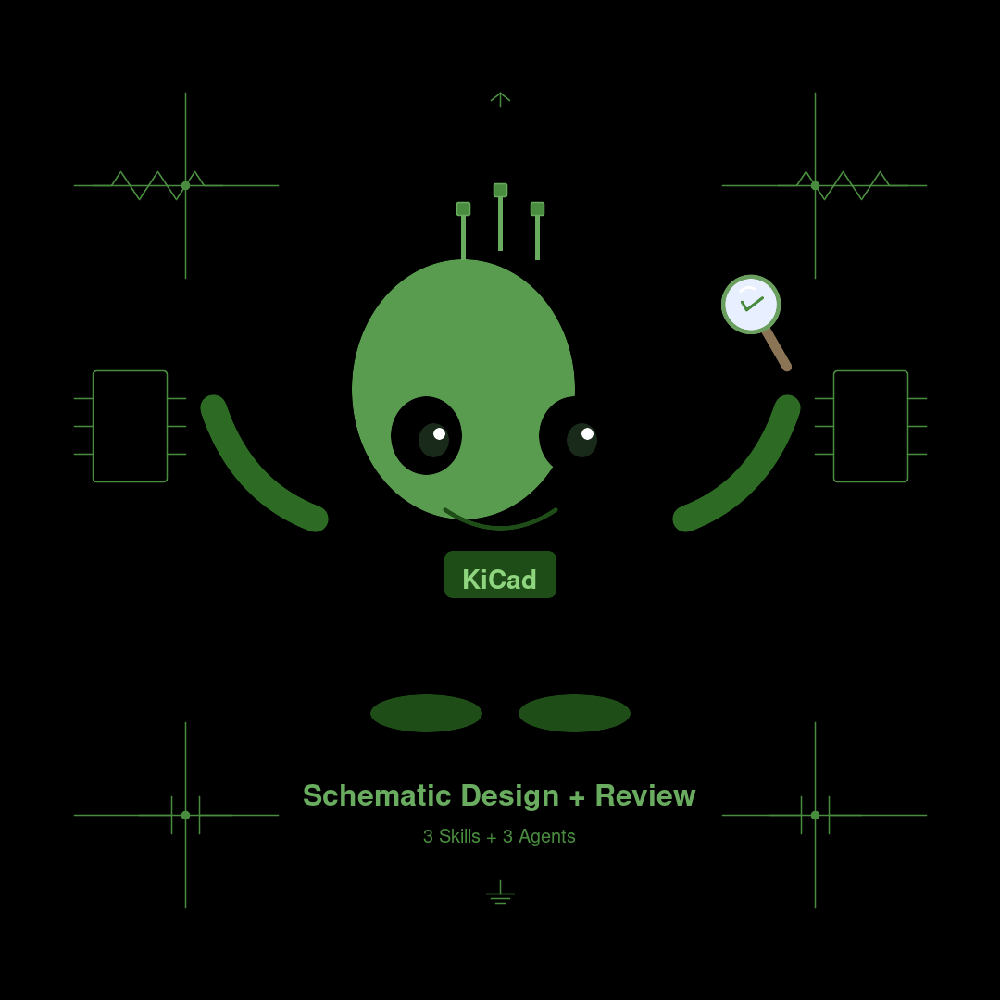

# pjy-claude-skill

Claude Code 플러그인 마켓플레이스 — 하드웨어 개발 스킬·에이전트 + Claude Code 메타 도구 모음

> **"말하면 만들어 준다"** — FPGA 설계부터 MCU 펌웨어까지, Claude Code에서 자연어로 하드웨어 프로젝트를 개발합니다. 그리고 Claude Code 자체 환경(CLAUDE.md / Permissions / Hooks / MCP / Subagent)도 단계적으로 진화시킵니다.

---

## 포함된 플러그인

<table>
<tr>
<td align="center" width="25%">
<br>
<b>Vivado FPGA</b><br>
RTL 설계 → 시뮬레이션 → 합성 → Bitstream<br>
13 스킬 + 6 에이전트
</td>
<td align="center" width="25%">
<br>
<b>STM32F4 Firmware</b><br>
5단계 파이프라인 + KiCad 검증 + TDD + 빌드 실행 + 코드 리뷰 + QA<br>
5 스킬 + 4 에이전트
</td>
<td align="center" width="25%">
<br>
<b>WMX3 Motion Module</b><br>
3-Layer 모듈 스캐폴딩 + TDD + RT 코드 리뷰<br>
8 스킬 + 6 에이전트
</td>
</tr>
<tr>
<td align="center" width="25%">
<br>
<b>KiCad Schematic</b><br>
PRD → 회로도 생성 + 8단계 리뷰 + BOM + 회로/PCB 분석(SI/PI)<br>
4 스킬 + 4 에이전트
</td>
</tr>
<tr>
<td align="center" width="25%">
<b>Sphinx Manual</b><br>
CHM/MD/DOCX → Sphinx 다국어(한/영/일) 매뉴얼 + 품질 리뷰<br>
4 스킬 + 4 에이전트
</td>
<td align="center" width="25%">
<b>Parallel Delegation</b><br>
서브에이전트 병렬 위임 워크플로 + 3-role 에이전트(구현/테스트/구현품질검증) (Claude Code 메타 도구)<br>
2 스킬 + 3 에이전트
</td>
<td align="center" width="25%">
<b>Claude Code Harness</b><br>
CLAUDE.md / Permissions / Hooks / MCP / Subagent / 진화 6단계 진단·진화 (Claude Code 메타 도구)<br>
1 스킬
</td>
</tr>
<tr>
<td align="center" width="25%">
<b>Manual Digest</b><br>
대용량 매뉴얼(PDF/HTML/EPUB/DOCX/CHM/MD) + 소스코드 디렉토리(codebase) 한 번 추출·요약 → ~0.3% 다이제스트만 1차 참조 (Claude Code 메타 도구)<br>
2 스킬
</td>
<td align="center" width="25%">
<b>React-Vite Frontend</b><br>
React 19 + Vite 8 + TS 프론트엔드 — Fluent UI v9 / shadcn/ui 택1, 범용 + UI별 구현·QA specialist 역할 분리<br>
2 스킬 + 6 에이전트
</td>
</tr>
</table>

---

## 스킬과 에이전트란?

Claude Code를 처음 사용한다면, 먼저 이 개념을 이해하세요.

### 스킬 = 작업 절차서

스킬은 Claude에게 **"이 작업은 이 순서로 해라"**라고 알려주는 레시피입니다.
사용자가 `/스킬명` 으로 직접 호출하거나, 대화 내용에 따라 자동으로 트리거됩니다.

```
사용자: "합성해줘"
Claude: (vivado-synth 스킬을 로드하고 정해진 TCL 절차를 실행)
```

### 에이전트 = 전문가

에이전트는 **별도 컨텍스트에서 독립적으로 작업하는 전문가**입니다.
메인 대화를 오염시키지 않고, 결과만 돌려줍니다.

```
사용자: "전체 리뷰해줘"
Claude: (RTL 리뷰어 + TB 리뷰어 + 핀 리뷰어 3명이 병렬로 작업 → 결과만 반환)
```

### 차이 한눈에 보기

| | 스킬 | 에이전트 |
|---|---|---|
| **비유** | 요리 레시피 | 전문 셰프 |
| **동작** | Claude가 레시피 보고 직접 실행 | 별도 전문가가 독립 작업 후 결과만 전달 |
| **언제 사용** | 정해진 절차가 있을 때 | 전문적 판단이 필요할 때 |

**사용할 때 구분할 필요 없습니다.** 원하는 것을 말하면 Claude가 알아서 판단합니다.

---

## 사전 준비

### 필수

- [Claude Code](https://claude.ai/code) 설치 및 실행 가능
- 터미널에서 `claude` 명령어 실행 가능

### 플러그인별 추가 요구사항

<details>
<summary><b>Vivado 플러그인</b></summary>

- AMD Vivado 2020.1 이상 (CLI batch 모드 지원)
- Linux 환경 (Ubuntu 20.04+, WSL2 포함)
- FPGA 보드 (시뮬레이션만 하면 보드 없이도 가능)
- KiCad 8.0+ (KiCad→XDC 자동 생성 사용 시, 선택 사항)

</details>

<details>
<summary><b>STM32F4 플러그인</b></summary>

- **STM32CubeIDE** 설치 (기본 — cmake, ninja, arm-none-eabi-gcc, STM32CubeProgrammer 번들)
- **VS Code** + **STM32 VS Code Extension** (ST 공식 확장)
- 또는 개별 설치: arm-none-eabi-gcc 10.3+, CMake 3.22+, Ninja 1.10+, OpenOCD 0.11+
- Linux 환경 (Ubuntu 20.04+, WSL2 포함)
- KiCad 8.0+ (회로도 검증 사용 시, 선택 사항)

</details>

<details>
<summary><b>WMX3 Motion Module 플러그인</b></summary>

- GCC 11+ (C99 + C++11 지원)
- CMake 3.16 이상
- Linux 환경 (Ubuntu 20.04+, WSL2 포함) 또는 Windows (Visual Studio 2022)
- WMX3 SDK (`LMX_INSTALLER_ROOT` 환경변수, 선택 사항 — 없어도 단위 테스트 가능)

</details>

<details>
<summary><b>Sphinx Manual 플러그인</b></summary>

- Python 3.8 이상
- `pip install sphinx sphinx-rtd-theme myst-parser sphinx-copybutton`
- LaTeX 패키지 (PDF 빌드 시, 선택 사항)
- `libchm-bin` 또는 `pychm` (CHM 파일 변환 시, 선택 사항)
- `pandoc` (DOCX 파일 변환 시, 선택 사항)

</details>

<details>
<summary><b>KiCad 플러그인</b></summary>

- KiCad 9.0+ (`kicad-cli` 명령어 사용 가능하면 최적, 없어도 동작)
- Linux 환경 (Ubuntu 20.04+, WSL2 포함)
- 인터넷 연결 (데이터시트 웹 검색용)
- (선택) [Seeed kicad-mcp-server](https://github.com/Seeed-Studio/kicad-mcp-server) — `kicad-analyze`의 PCB 신호/전원 무결성(SI/PI)·정밀 트랙 분석용. KiCad 9.0+ 로컬 설치 전제. 미등록 시 `kicad-cli`/직접 파싱으로 폴백

</details>

<details>
<summary><b>Parallel Delegation 플러그인</b></summary>

- Claude Code만 있으면 동작 (Agent 도구 활성)
- 선택: OMC(oh-my-claudecode) 설치 시 — 동일 역할의 OMC 에이전트(`executor` / `test-engineer` / `verifier`) 자동 인식·연동
- 선택: 사용자 정의 `.claude/agents/` — 같은 역할이 있으면 덮어쓰지 않고 누락분만 보충

</details>

<details>
<summary><b>Claude Code Harness 플러그인</b></summary>

- Claude Code만 있으면 동작 (외부 의존성 없음)
- 분석 대상: 프로젝트의 `CLAUDE.md`, `.claude/settings.json`, `.mcp.json`, `.claude/agents/`, `.claude/hooks/` (있는 만큼만 진단)
- **새 프로젝트보다 2~4주 이상 사용한 프로젝트에 더 효과적** — 진단할 데이터(반복 실수, 안 쓰이는 규칙)가 쌓인 후 도입 권장

</details>

<details>
<summary><b>Manual Digest 플러그인</b></summary>

- Claude Code + Node.js (npx 사용)
- PDF 추출용 MCP: `@sylphx/pdf-reader-mcp` — `manual-digest-setup` 스킬이 자동 등록
- Windows: `cmd /c npx -y @sylphx/pdf-reader-mcp` 래퍼 사용 (PowerShell 환경 안정성)
- 텍스트 레이어 없는 스캔 PDF는 미지원 (OCR은 V2 이후)
- 디스크 쓰기 권한: `<project>/.claude/manuals/` (project scope) 또는 `~/.claude/manuals/` (global scope)

</details>

<details>
<summary><b>React-Vite Frontend 플러그인</b></summary>

- Claude Code + Node.js 20.19+ 또는 22.12+ (Vite 8 요구사항)
- 대상 프로젝트: React 19 + Vite 8 + TypeScript (신규 스캐폴딩도 지원)
- UI 라이브러리: **Fluent UI v9** 또는 **shadcn/ui**(Radix+Tailwind) 중 프로젝트당 택1 — 감지/질문 후 그쪽 컨벤션만 적용 (혼용 금지)
- 권장 스택: Zustand+Immer / (선택) react-konva, @dnd-kit — 이미 다른 스택이 있으면 그쪽을 존중
- 선택: Context7 MCP 설치 시 라이브러리 API를 공식 문서로 확인

</details>

---

## 설치 방법 (초보자 가이드)

### Step 1: 마켓플레이스 추가

Claude Code 터미널에서 다음을 입력합니다. **한 번만 하면 됩니다.**

```
/plugin marketplace add pjy4617/pjy-claude-skill
```

이렇게 하면 이 저장소가 마켓플레이스로 등록됩니다.

### Step 2: 원하는 플러그인 설치

#### Vivado (FPGA 개발) 설치

```
/plugin install vivado@pjy-skills
```

13개 스킬이 한 번에 활성화됩니다. 이후 에이전트를 설치합니다:

```
/vivado-setup
```

셋업 시 프로젝트 경로를 질문합니다. 지정한 경로에 6개 에이전트, CLAUDE.md, 디렉토리 구조(`rtl/`, `tb/`, `constraints/`, `scripts/`, `build/`)가 생성됩니다.

#### STM32F4 (MCU 펌웨어) 설치

```
/plugin install stm32f4@pjy-skills
```

5개 스킬이 한 번에 활성화됩니다. 이후 에이전트를 설치합니다:

```
/stm32f4-setup
```

셋업 시 프로젝트 경로를 질문합니다. 지정한 경로에 4개 에이전트, CLAUDE.md, 디렉토리 구조(`Core/`, `Drivers/`, `Middlewares/`, `Startup/`, `Linker/`, `build/`)가 생성됩니다.

#### WMX3 (모션 제어 모듈) 설치

```
/plugin install wmx3md@pjy-skills
```

8개 스킬이 한 번에 활성화됩니다. 이후 에이전트를 설치합니다:

```
/wmx3-setup
```

셋업 시 프로젝트 경로를 질문합니다. 지정한 경로에 6개 에이전트와 CLAUDE.md가 생성됩니다.

#### Manual (Sphinx 문서화) 설치

```
/plugin install manual@pjy-skills
```

4개 스킬이 한 번에 활성화됩니다. 이후 에이전트를 설치합니다:

```
/manual-setup
```

4개 에이전트와 CLAUDE.md가 설치됩니다.

#### KiCad (회로도 설계+리뷰) 설치

```
/plugin install kicad@pjy-skills
```

4개 스킬이 한 번에 활성화됩니다. 이후 에이전트를 설치합니다:

```
/kicad-setup
```

셋업 시 프로젝트 경로를 질문합니다. 지정한 경로에 4개 에이전트와 CLAUDE.md가 생성됩니다.
PCB 신호/전원 무결성(SI/PI)까지 정밀 분석하려면 `/kicad-setup --with-mcp`로 Seeed kicad-mcp-server 등록을 안내받을 수 있습니다(KiCad 9.0+ 로컬 설치 전제).

#### Parallel Delegation (병렬 위임 워크플로) 설치

```
/plugin install parallel-delegation@pjy-skills
```

2개 스킬이 한 번에 활성화됩니다. 이후 3-role 에이전트를 설치합니다:

```
/parallel-delegation-setup
```

셋업 시 프로젝트 경로를 질문합니다. 기존 `.claude/agents/`와 OMC 설치 여부를 자동 스캔해 **누락된 역할만 보충 설치**합니다 (사용자 정의 에이전트 우선, 덮어쓰기 안 함). pd-implementer / pd-tester / pd-verifier 3개 에이전트가 설치됩니다.

#### Claude Code Harness 설치

```
/plugin install harness@pjy-skills
```

1개 스킬이 활성화됩니다. **별도 setup 명령 없음** — 자연어로 "내 프로젝트 하네스 봐줘"라고 말하면 진단이 시작됩니다. 프로젝트 경로 질문 없이 현재 디렉토리에서 동작합니다 (다른 플러그인과 다른 점).

#### Manual Digest (대용량 매뉴얼 다이제스트) 설치

```
/plugin install manual-digest@pjy-skills
```

2개 스킬이 활성화됩니다. **첫 사용 전 1회 환경 초기화 필수**:

```
/manual-digest-setup
```

PDF 추출용 MCP(`@sylphx/pdf-reader-mcp`)를 자동 등록하고 `.claude/manuals/` 디렉토리 + INDEX.md + CLAUDE.md 마커 블록을 생성합니다. **MCP 신규 등록 시 Claude Code 세션 재시작이 필요합니다.** idempotent — 여러 번 실행해도 안전하며 누락분만 보충합니다 (`--scope project|global|both`, `--mcp-only`, `--skip-mcp`, `--repair`, `--dry-run` 옵션).

#### React-Vite (React 19 프론트엔드 개발) 설치

```
/plugin install react-vite@pjy-skills
```

2개 스킬이 한 번에 활성화됩니다. 이후 에이전트를 설치합니다:

```
/react-vite-setup
```

셋업 시 프로젝트 경로를 질문합니다. 지정한 경로에 6개 에이전트(범용 구현/QA 2종 + Fluent UI·shadcn/ui 라이브러리별 구현·QA specialist 4종)와 CLAUDE.md가 생성됩니다. 프로젝트가 한 UI 라이브러리만 쓰면 반대쪽 specialist 2종은 삭제해도 됩니다.

#### 여러 플러그인 동시 설치

```
/plugin install vivado@pjy-skills
/plugin install stm32f4@pjy-skills
/plugin install wmx3md@pjy-skills
/plugin install manual@pjy-skills
/plugin install kicad@pjy-skills
/plugin install parallel-delegation@pjy-skills
/plugin install harness@pjy-skills
/plugin install manual-digest@pjy-skills
/plugin install react-vite@pjy-skills
```

각 플러그인은 독립적이므로 원하는 것만 설치할 수 있습니다.

### Step 3: 설치 확인

설치가 잘 되었는지 확인하려면:

```
/plugin list
```

설치된 스킬이 표시되면 성공입니다.

---

## 사용법

###  Vivado 플러그인 — 이렇게 말하면 됩니다

| 하고 싶은 것 | 이렇게 말하세요 | 동작하는 스킬/에이전트 |
|-------------|---------------|---------------------|
| 프로젝트 생성 | "ZedBoard용 OLED 프로젝트 만들어줘" | vivado-project 스킬 |
| RTL 설계 | "SPI 제어 Verilog 모듈 만들어줘" | rtl-designer 에이전트 |
| 코드 리뷰 | "전체 리뷰해줘" | 3개 에이전트 병렬 (RTL+TB+Pin) |
| 시뮬레이션 | "시뮬레이션 돌려줘" | vivado-sim 스킬 |
| 합성 | "합성해줘" | vivado-synth 스킬 |
| Implementation | "impl 돌려줘" | vivado-impl 스킬 |
| Bitstream | "비트스트림 만들어줘" | vivado-bitstream 스킬 |
| 타이밍 문제 | "타이밍 분석해줘" | timing-analyst 에이전트 |
| GUI 확인 | "파형 보여줘" / "스키매틱 보여줘" | vivado-gui 스킬 |
| KiCad→XDC | "KiCad에서 XDC 만들어줘" | kicad-xdc-gen 에이전트 |
| 전체 빌드 | "합성부터 비트스트림까지 돌려줘" | vivado-build-all 스킬 |

#### Vivado 전체 워크플로우

```
"프로젝트 만들어줘"           ← vivado-project 스킬
    ↓
"모듈 만들어줘"               ← rtl-designer 에이전트
    ↓
"전체 리뷰해줘"               ← 3개 에이전트 병렬 검사
    ↓ (FAIL=0 될 때까지 반복)
"시뮬레이션 돌려줘"           ← vivado-sim 스킬
    ↓
"합성해줘"                    ← vivado-synth 스킬
    ↓
"impl 돌려줘"                 ← vivado-impl 스킬
    ↓
"비트스트림 만들어줘"         ← vivado-bitstream 스킬
    ↓
"FPGA에 다운로드해줘"         ← vivado-bitstream 스킬
```

---

###  STM32F4 플러그인 — 이렇게 말하면 됩니다

| 하고 싶은 것 | 이렇게 말하세요 | 동작하는 스킬/에이전트 |
|-------------|---------------|---------------------|
| 펌웨어 생성 | "STM32F407로 SPI 코덱 펌웨어 만들어줘" | stm32f4-firmware 스킬 (5단계 파이프라인) |
| 회로도 검증 | "KiCad STM32 검토해줘" | kicad-stm32-review 스킬 + checker 에이전트 |
| 테스트 추가 | "테스트 추가해줘" | stm32f4-tdd 스킬 + test-writer 에이전트 |
| TDD 개발 | "TDD로 SPI 드라이버 만들어줘" | test-writer가 Red→Green→Refactor |
| 빌드 실행 | "빌드해줘" / "컴파일해줘" | stm32f4-build 스킬 (CMake+Ninja, CubeMX/CubeIDE 자동 변환) |
| 플래싱 | "빌드하고 플래싱해줘" | stm32f4-build --flash (STM32CubeProgrammer/OpenOCD) |
| 코드 리뷰 | "코드 리뷰해줘" | code-reviewer 에이전트 (34항목) |
| 최종 검수 | "릴리스 가능한지 확인해줘" | qa 에이전트 (PASS/CONDITIONAL/REJECT) |

#### STM32F4 전체 워크플로우

```
"KiCad STM32 검토해줘"        ← 회로도 핀 검증 (42항목), KiCad가 있을 때
    ↓ (ERROR=0 확인)
"이 회로도 기반으로 펌웨어 만들어줘"
    ↓
  Agent 1: 요구사항 분석      ← MCU, 클럭, 페리페럴, 핀 추출
  Agent 2: 아키텍처 설계      ← Bare-metal vs RTOS 판단
  Agent 3: 코드 생성          ← HAL 기반 소스코드
  Agent 4: 빌드 구성          ← CMake/Makefile + 링커 + OpenOCD + VS Code
  Agent 5: 코드 검토          ← 7개 카테고리 검증 (핀, 클럭, 메모리, 테스트 등)
    ↓ (ERROR → 해당 에이전트로 되돌아가 수정, 최대 3회)
"테스트 추가해줘"             ← Unity + FFF 호스트 기반 단위 테스트
    ↓
  cd test && make             ← PC에서 테스트 실행
    ↓
"빌드해줘"                    ← stm32f4-build (.cproject/Makefile → CMake 자동 변환 → 빌드)
    ↓
"코드 리뷰해줘"              ← code-reviewer (34항목 검사)
    ↓
"릴리스 가능한지 확인해줘"    ← qa 에이전트 (종합 판정)
```

---

### WMX3 Motion Module 플러그인 — 이렇게 말하면 됩니다

| 하고 싶은 것 | 이렇게 말하세요 | 동작하는 스킬/에이전트 |
|-------------|---------------|---------------------|
| 새 모듈 생성 | "CmdBuffer 모듈 만들어줘" | wmx3-module-create 스킬 (designer → generator → build-checker) |
| 빌드 | "빌드해줘" | wmx3-build 스킬 |
| API 추가 | "SetCmdBuffer API 추가해줘" | wmx3-module-add-api 스킬 |
| 테스트 작성 | "테스트 작성해줘" | wmx3-tdd 스킬 + test-writer 에이전트 |
| 코드 리뷰 | "코드 리뷰해줘" | wmx3-code-review 스킬 + code-reviewer 에이전트 |
| 문서 생성 | "API 문서 만들어줘" | wmx3-docs 스킬 + doc-writer 에이전트 |

#### WMX3 전체 워크플로우

```
"새 모듈 만들어줘"               ← wmx3-module-create (3-layer 스캐폴딩)
    ↓  designer → generator → build-checker
"빌드해줘"                       ← wmx3-build (Linux/Windows 자동 감지)
    ↓
"테스트 작성해줘"                ← wmx3-tdd (gtest/gmock)
    ↓
"코드 리뷰해줘"                  ← wmx3-code-review (RT 안전성 35항목)
    ↓ (CRITICAL=0, MAJOR=0 될 때까지 반복)
"API 문서 만들어줘"              ← wmx3-docs (4종 문서 자동 생성)
```

#### 3-Layer 아키텍처

```
사용자 애플리케이션 (C++ / C#)
    ↓ C++ 링크
Layer 2: <ModuleName>Api (C++11 정적 라이브러리)
    ↓ IPC (IMDll)
═══════════ 실시간 경계 ═══════════
Layer 1: <ModuleName> (C99 Core RTDLL/SO)
    ↓
WMX3 엔진 + IMLib + OSL
```

---

### Sphinx Manual 플러그인 — 이렇게 말하면 됩니다

| 하고 싶은 것 | 이렇게 말하세요 | 동작하는 스킬/에이전트 |
|-------------|---------------|---------------------|
| 매뉴얼 생성 | "사용자 매뉴얼 만들어줘" | manual-write 스킬 (6단계 프로세스) |
| Doxygen 변환 | "MD 파일들을 Sphinx로 변환해줘" | sphinx-manual-writer 에이전트 |
| DOCX 변환 | "Word 문서를 Sphinx로 변환해줘" | manual-write 스킬 (Phase 1-E) |
| 빌드 | "매뉴얼 빌드해줘" | manual-build 스킬 |
| 품질 리뷰 | "매뉴얼 리뷰해줘" | manual-review 스킬 + reviewer 에이전트 |

#### Manual 전체 워크플로우

```
"매뉴얼 만들어줘"                 ← manual-write (Phase 1~6)
    ↓  소스 분석 → 구조 제안(승인) → Sphinx 초기화 → 내용 작성 → 빌드 → 검증
"매뉴얼 리뷰해줘"                 ← manual-review (6카테고리 100점)
    ↓  자동 수정 가능 이슈 → "수정할까요?" → 재빌드
"매뉴얼 빌드해줘"                 ← manual-build (HTML/PDF/EPUB, 다국어)
```

---

###  KiCad 플러그인 — 이렇게 말하면 됩니다

| 하고 싶은 것 | 이렇게 말하세요 | 동작하는 스킬/에이전트 |
|-------------|---------------|---------------------|
| 회로도 생성 | "이 PRD로 회로도 만들어줘" | kicad-design 스킬 + designer 에이전트 |
| 회로도 리뷰 | "회로도 리뷰해줘" | kicad-review 스킬 + reviewer 에이전트 |
| BOM 생성 | "BOM 만들어줘" | kicad-review 스킬 + bom-generator 에이전트 |
| 데이터시트 비교 | "IC 데이터시트 확인해줘" | kicad-review 스킬 (단계 6) |
| PCB 분석 | "PCB 분석해줘 / DRC 돌려줘" | kicad-analyze 스킬 + pcb-analyzer 에이전트 |
| 넷 추적 | "+3V3 넷에 뭐 연결됐는지 추적해줘" | kicad-analyze 스킬 (단계 3) |
| 신호/전원 무결성 | "차동 페어 임피던스·길이 매칭 확인해줘" | kicad-analyze 스킬 (단계 5, Seeed MCP 권장) |
| 부품 변경 | "RJ45로 바꿔줘" | kicad-design 에이전트 (수정 모드) |
| 에이전트 설치 | "KiCad 설정해줘" | kicad-setup 스킬 (`--with-mcp`로 Seeed MCP 등록) |

#### KiCad 전체 워크플로우

```
"이 PRD로 회로도 만들어줘"       ← kicad-design (5단계)
    ↓  요구사항 분석 → IC 선정 → 데이터시트 수집 → .kicad_sch 생성 → 리뷰
"회로도 리뷰해줘"                ← kicad-review (8단계)
    ↓  PDF 시각 검토 → 라이브러리 비교 → 체크리스트 → 데이터시트 대조
"BOM 만들어줘"                   ← BOM 마크다운 생성
    ↓
KiCad GUI에서 와이어 보정 (5~15분)
    ↓
"ERROR 수정해줘"                 ← ERROR 항목 수정 후 재리뷰
    ↓ (ERROR=0 확인)
PCB 레이아웃 진행
    ↓
"PCB 분석해줘 / DRC 돌려줘"      ← kicad-analyze (6단계)
    ↓  넷 추적 → ERC/DRC → 트랙/라우팅 → 신호·전원 무결성(SI/PI)
       (Seeed MCP 등록 시 SI/PI 정밀, 없으면 kicad-cli/직접 파싱 폴백)
```

---

### Parallel Delegation 플러그인 — 이렇게 말하면 됩니다

여러 독립 작업을 **하나의 응답 메시지**에 다수 Agent 호출로 묶어 동시 실행하는 워크플로. 순차 실행 대비 벽시계 시간을 가장 느린 작업 하나의 길이로 압축합니다.

| 하고 싶은 것 | 이렇게 말하세요 | 동작 |
|-------------|---------------|------|
| 다부분 작업 동시 실행 | "A하고 B하고 C 한 번에 해줘" / "동시에" / "한꺼번에" | 메인이 단일 응답에 다수 Agent 호출 |
| 구현 + 테스트 분리 | "구현해줘 + 테스트도 추가" | pd-implementer + pd-tester 병렬 |
| 자기 검증 함정 차단 | "리뷰해줘" / "검증해줘" | pd-verifier — 구현·테스트와 분리된 시각 |
| 다파일 리팩토링 | "X 모듈 리팩토링하면서 테스트 갱신" | 다수 pd-implementer 병렬 |
| 3-role 에이전트 설치 | "병렬 위임 설정", "3-role 셋업" | parallel-delegation-setup 스킬 |

#### 3-role 분리 패턴

```
[메인 Claude]
    ↓ (단일 응답에 3개 Agent 호출 묶음)
    ├──[pd-implementer]── 구현 전담 ("어떻게 동작하게 할지")
    ├──[pd-tester]────── 테스트 전담 ("무엇이 옳은 동작인지")
    └──[pd-verifier]──── 구현품질검증 ("결과물이 사양·통합·품질을 만족?")
    ↓
결과 합성·검증 → 사용자
```

> **핵심: 메시지 단위 = 병렬 단위.** 하나의 응답에 묶인 Agent 호출만 동시 시작. 첫 호출 결과를 보고 두 번째를 호출하면 순차로 변해 시간 이득이 사라집니다.
>
> **OMC 호환**: oh-my-claudecode 설치 환경에선 OMC의 `executor` / `test-engineer` / `verifier`가 같은 역할을 수행 — 셋업 스킬이 자동 인식해 중복 설치를 피합니다.

---

### Claude Code Harness 플러그인 — 이렇게 말하면 됩니다

이 플러그인은 다른 플러그인과 달리 **하드웨어 도구가 아니라 Claude Code 자체 환경**(CLAUDE.md / Permissions / Hooks / MCP / Subagent / 진화 원칙)을 단계적으로 진단·강화합니다.

| 하고 싶은 것 | 이렇게 말하세요 | 동작하는 모드 |
|-------------|---------------|---------------|
| 전체 진단·보강 | "내 프로젝트 하네스 봐줘" / "어디 약해?" | 모드 A 전체 흐름 |
| 진단만 | "지금 상태만 알려줘. 변경은 하지 말고" | 모드 B 진단만 |
| 단일 단계 | "rm 같은 거 막아줘" / "코드 수정 시 npm test 자동" | 모드 C 특정 단계 |
| 진화 점검 | "Opus 4.7 올렸어, 점검해줘" / "오래된 규칙 정리" | 모드 D 진화 점검 |

#### 하네스 진화 워크플로우

```
"하네스 봐줘"                    ← Phase 0 진단 (6단계 ✅/⚠️/❌ + 우선순위 추천)
    ↓
"단계 2부터" / "rm 막아줘"       ← 5-step 패턴 ([a]현재상태 → [b]추천 → [c]확정대기 → [d]적용 → [e]다음 단계)
    ↓ (사용자 명시 승인 — "적용해" / "yes")
파일 Edit/Write 적용
    ↓
"다음 단계 진행"                 ← 의존성 순: deny → Hook → CLAUDE.md → Subagent
    ↓
정기 점검 루틴                   ← 월 1회 / 모델 업그레이드 후 / 마일스톤 종료 후
```

> **추천만 하고 임의로 적용하지 않습니다.** 명시적 승인("적용해" / "yes") 후에만 파일을 수정합니다.
>
> **새 프로젝트보다 기존 프로젝트 진화에 효과적**. 새 프로젝트는 `/init` + 2~4주 사용 후 도입을 권장합니다 — 자세한 내용은 [`plugins/harness/docs/usage-guide.md`](plugins/harness/docs/usage-guide.md).

---

### Manual Digest 플러그인 — 이렇게 말하면 됩니다

대용량 매뉴얼 **또는 소스코드 디렉토리**를 **한 번만** 추출·요약하여 마크다운 다이제스트로 저장하고, 이후 작업에서는 다이제스트(원본의 ~0.3% 크기)를 1차 참조하는 워크플로. 디테일이 필요할 때만 원본의 특정 페이지/섹션(문서) 또는 파일/심볼(코드)만 핀포인트로 다시 읽습니다 (실측: TwinCAT 168p 매뉴얼 6.29 MB → 18.6 KB; HMI Frontend 18,079 LOC → ~14 KB).

| 하고 싶은 것 | 이렇게 말하세요 | 동작하는 스킬 |
|-------------|---------------|--------------|
| 환경 셋업(1회) | "manual-digest 셋업" / `/manual-digest-setup` | manual-digest-setup 스킬 |
| 매뉴얼 등록 | "이 PDF 등록해줘" / `/manual-digest <path>` | manual-digest 스킬 (8단계) |
| 코드베이스 등록 | "이 레포 코드 다이제스트 만들어줘" / `/manual-digest <dir>` | manual-digest 스킬 (`format: codebase`, MCP 불필요) |
| Global scope 등록 | `/manual-digest <path> --scope global` | 모든 프로젝트 공유 |
| 원본 변경 시 갱신 | `/manual-digest --update <id>` | 문서=sha256 / 코드=git ref 비교 → 변경분만 재요약 |
| 등록 매뉴얼 목록 | "등록된 매뉴얼 목록" / `/manual-digest --list` | INDEX.md 출력 |
| 매뉴얼 제거 | `/manual-digest --remove <id>` | 디렉토리 + INDEX.md + CLAUDE.md 카탈로그 갱신 |
| 자동 활용 | (도메인 매뉴얼 질문) | Claude가 INDEX.md → digest.md → 필요 시 원본 핀포인트 |

#### 지원 포맷

| 포맷 | 추출 도구 |
|------|-----------|
| PDF | `@sylphx/pdf-reader-mcp` MCP (`mcp__pdf-reader__read_pdf`) |
| HTML | Claude Read 직접 |
| TXT/MD | Claude Read 직접 |
| EPUB | PowerShell `Expand-Archive` → 내부 XHTML |
| DOCX | PowerShell `Expand-Archive` → `word/document.xml` |
| CHM | `hh.exe -decompile` (Windows 전용) |
| **codebase (디렉토리)** | **Claude Read/Grep/Glob + `find`/`git` (PDF MCP 불필요)** |

#### Manual Digest 전체 워크플로우

```
"manual-digest 셋업"             ← manual-digest-setup (MCP 등록 + 디렉토리 + CLAUDE.md 마커)
    ↓ (Claude Code 재시작)
"이 매뉴얼 등록해줘"              ← /manual-digest <path>
    ↓  ① 입력 검증 → ② ID 결정 → ③ 텍스트 추출 → ④ TOC 파싱
    ↓  ⑤ 섹션 청킹(~20% 샘플링) → ⑥ 계층 요약 → ⑦ 산출물 작성 → ⑧ 카탈로그 갱신
산출물: <scope>/.claude/manuals/<id>/{digest.md, index.md, metadata.json}
    ↓
(이후 매뉴얼 관련 질문)          ← Claude 자동 동작
    ↓  INDEX.md 확인 → digest.md 1차 참조 → 부족 시 index.md → 원본 페이지 핀포인트
    ↓  답변 + 출처 명시 (§/p./scope)
"원본 변경됨"                     ← /manual-digest --update <id> (sha256 비교, 변경분만)
```

#### Scope 결정 가이드

| 상황 | 권장 scope |
|------|-----------|
| 특정 보드 데이터시트, 프로젝트 전용 SDK | `project` (기본) |
| ARM Cortex-M TRM, C99 표준 등 표준 매뉴얼 | `global` |
| 여러 프로젝트 공유 라이브러리 매뉴얼 | `global` |

> **MCP 재시작 주의**: `manual-digest-setup`이 PDF MCP를 신규 등록하면 Claude Code 세션을 종료 후 다시 시작해야 `mcp__pdf-reader__read_pdf` 도구가 활성화됩니다.
>
> **CLAUDE.md 마커 블록**: 셋업이 `<!-- manual-digest:start --> ... <!-- manual-digest:end -->` 마커 사이에 사용 규칙을 주입합니다 — 마커 외부 콘텐츠는 절대 건드리지 않습니다. 손상 시 `/manual-digest-setup --repair`.

---

### React-Vite Frontend 플러그인 — 이렇게 말하면 됩니다

React 19 + Vite 8 + TypeScript 프론트엔드를 **구현 → 검증**의 역할 분리 흐름으로 개발합니다. **범용 에이전트**(React/Vite/상태/구조)와 **UI 라이브러리 specialist**(테마·컴포넌트·전용 테스트)를 **별도 패스**로 운용해, 한 에이전트가 자기 코드를 검증할 때 생기는 자기검증 함정을 차단합니다. UI 라이브러리는 **Fluent UI v9** 또는 **shadcn/ui** 중 프로젝트당 하나를 골라(감지/질문) 그쪽 specialist만 씁니다.

**에이전트 6종**: 범용 `react-vite-program-expert`/`react-vite-qa-expert` + Fluent `react-vite-fluent-ui-expert`/`react-vite-fluent-ui-qa-expert` + shadcn `react-vite-shadcn-ui-expert`/`react-vite-shadcn-ui-qa-expert`.

| 하고 싶은 것 | 이렇게 말하세요 | 동작하는 스킬/에이전트 |
|-------------|---------------|--------------|
| 환경 셋업 | "react-vite 셋업" / `/react-vite-setup` | react-vite-setup 스킬 |
| 기능 개발(구현→검증) | "이 PRD로 화면 구현하고 테스트까지 해줘" | react-vite-frontend 스킬 (specialist 자동 라우팅) |
| 범용 구현 | "Zustand 스토어에 액션 추가해줘" | react-vite-program-expert |
| Fluent UI 구현 | "Fluent 테마 설정/DataGrid 만들어" | react-vite-fluent-ui-expert |
| shadcn 구현 | "shadcn으로 Combobox 만들어" | react-vite-shadcn-ui-expert |
| UI 테스트 작성 | "이 Radix Select 테스트 작성해줘" | react-vite-shadcn-ui-qa-expert (Fluent이면 fluent-ui-qa) |
| 범용 검증 | "Zustand/성능 회귀 검증해줘" | react-vite-qa-expert |

#### 워크플로우

```
"이 기능 구현하고 테스트까지 해줘"   ← react-vite-frontend 스킬
    ↓  ① 컨텍스트 파악(package.json/PRD/UI 라이브러리 감지) → ② 분해(타입/스토어/컴포넌트)
    ↓  ③ 구현 위임 → 범용(program-expert) + UI specialist(fluent/shadcn-ui-expert)
    ↓  ④ npm run dev / tsc --noEmit 로 동작·타입 확인
    ↓  ⑤ 검증 위임 → 범용(qa-expert) + UI QA specialist (Vitest/RTL/Playwright/axe-core + 성능)
    ↓  ⑥ 지적사항 다시 해당 구현 에이전트로 반영 (⑤↔⑥ 반복)
```

---

#### 펌웨어 생성 시 Claude가 물어보는 것들

정보가 부족하면 Claude가 순서대로 질문합니다:

1. **MCU** — "어떤 STM32F4 칩을 사용하시나요?" (미지정 시 자동 추천)
2. **HSE 주파수** — "외부 크리스탈이 몇 MHz인가요?" (기본: 8MHz)
3. **외부 IC** — "연결할 IC의 정확한 모델명은?" (필수 질문)
4. **핀 제약** — "사용할 수 없는 핀이 있나요?" (기본: 없음)
5. **전원 전압** — "3.3V인가요?" (기본: 3.3V)
6. **빌드 시스템** — "CMake? Makefile?" (기본: CMake)
7. **디버그 프로브** — "ST-Link v2? v3? J-Link?" (기본: ST-Link v2)

전부 답하지 않아도 됩니다. 미답변 항목은 기본값을 사용하고, 기본값 사용 사실을 명시합니다.

---

## 리뷰 결과 읽는 법

Vivado와 STM32F4 모두 동일한 3단계 등급을 사용합니다:

| 등급 | 의미 | 조치 |
|------|------|------|
| **ERROR** | 반드시 수정해야 함. 동작 불가 또는 하드웨어 손상 위험 | "FAIL 항목 수정해줘" |
| **WARN** | 동작은 하지만 잠재적 문제. 권장 수정 | 지금 안 고쳐도 됨 |
| **OK** / **PASS** | 이상 없음 | 다음 단계로 진행 |

리뷰에서 ERROR가 나오면:

```
사용자: "FAIL 항목 전부 수정해줘"
(수정 후)
사용자: "다시 리뷰해줘"
(FAIL=0이 될 때까지 반복)
```

---

## 지원하는 MCU / FPGA

### STM32F4 시리즈

| MCU | 최대 클럭 | Flash | 특징 |
|-----|----------|-------|------|
| F401 | 84MHz | 256KB | 최저가, USB, SPI4 |
| F411 | 100MHz | 512KB | 저가+USB, SPI3/4/5, SDIO |
| F407 | 168MHz | 1MB | 기준 MCU, CAN, ETH, DAC |
| F429 | 168MHz | 2MB | LCD(LTDC), FMC, Dual Bank Flash |
| F446 | 180MHz | 512KB | 최고 클럭, QUADSPI, SAI, FMPI2C |

각 MCU별로 **공식 데이터시트 기반 AF 매핑 JSON**이 포함되어 있어, 핀 검증 시 타겟 MCU에 맞는 정확한 검증이 이루어집니다.

### Vivado FPGA

boards.json에 등록된 보드를 지원합니다 (Arty A7, ZedBoard 등). 보드 추가도 가능합니다.

---

## 폴더 구조

```
pjy-claude-skill/
├── .claude-plugin/
│   └── marketplace.json           ← 마켓플레이스 카탈로그
├── plugins/
│   ├── vivado/                    ← Vivado FPGA 플러그인
│   │   ├── plugin.json
│   │   ├── skills/ (13개)         ← 스킬 (SKILL.md + 보조 파일)
│   │   ├── agents/ (6개)          ← 에이전트 (.md)
│   │   ├── claude-md/             ← 프로젝트 CLAUDE.md 템플릿
│   │   ├── templates/             ← 예제 RTL/TB/XDC
│   │   └── docs/                  ← 사용 가이드
│   ├── stm32f4/                   ← STM32F4 MCU 플러그인
│   │   ├── plugin.json
│   │   ├── skills/ (5개)
│   │   │   ├── stm32f4-firmware/  ← 5단계 파이프라인
│   │   │   │   ├── references/    ← 7개 참조 문서
│   │   │   │   ├── references/af-tables/  ← 5개 MCU AF 매핑 JSON
│   │   │   │   └── assets/templates/      ← 8개 빌드 템플릿
│   │   │   ├── kicad-stm32-review/        ← 회로도 검증 (42항목)
│   │   │   ├── stm32f4-tdd/              ← TDD (Unity+FFF)
│   │   │   ├── stm32f4-build/            ← 빌드 실행 (CMake+Ninja)
│   │   │   └── stm32f4-setup/            ← 환경 설정
│   │   ├── agents/ (4개)          ← checker, test-writer, code-reviewer, qa
│   │   ├── claude-md/
│   │   └── docs/
│   ├── wmx3md/                    ← WMX3 Motion Module 플러그인
│   │   ├── plugin.json
│   │   ├── skills/ (8개)          ← 모듈 생성, 빌드, API 추가, TDD, 리뷰, 문서, 배포
│   │   │   └── wmx3-module-create/
│   │   │       ├── assets/templates/  ← 3-layer 코드 템플릿
│   │   │       └── references/        ← 설계 가이드 (상태 머신, IPC, 네이밍 등)
│   │   ├── agents/ (6개)          ← designer, generator, build-checker, test-writer, code-reviewer, doc-writer
│   │   ├── claude-md/
│   │   └── docs/
│   ├── manual/                    ← Sphinx 문서화 플러그인
│   │   ├── plugin.json
│   │   ├── skills/ (4개)          ← 문서 생성, 빌드, 리뷰, 환경 설정
│   │   │   └── manual-write/
│   │   │       └── references/    ← 다국어 네비게이션 템플릿
│   │   ├── agents/ (4개)          ← sphinx-manual-writer, manual-writer, windows-manual-writer, manual-reviewer
│   │   ├── claude-md/
│   │   └── docs/
│   ├── kicad/                     ← KiCad 회로도 플러그인
│   │   ├── plugin.json
│   │   ├── skills/ (4개)          ← 회로도 설계, 리뷰+BOM, 회로/PCB 분석, 환경 설정
│   │   │   ├── kicad-design/      ← PRD → 회로도 생성
│   │   │   │   └── references/    ← S-expression 포맷 + .kicad_pro 가이드
│   │   │   ├── kicad-review/      ← 8단계 리뷰 + BOM 생성
│   │   │   │   └── references/    ← 체크리스트, 파싱, 데이터시트, Ethernet 프런트엔드
│   │   │   ├── kicad-analyze/     ← 회로/PCB 정밀 분석 (ERC/DRC, 넷 추적, SI/PI)
│   │   │   │   └── references/    ← Seeed MCP 도구 매핑, PCB 분석·SI/PI 가이드
│   │   │   └── kicad-setup/
│   │   ├── agents/ (4개)          ← designer, reviewer, bom-generator, pcb-analyzer
│   │   ├── claude-md/
│   │   └── docs/
│   ├── parallel-delegation/       ← 서브에이전트 병렬 위임 플러그인 (메타 도구)
│   │   ├── plugin.json
│   │   ├── skills/ (2개)           ← 병렬 위임 워크플로 + 3-role 에이전트 셋업
│   │   ├── agents/ (3개)           ← pd-implementer, pd-tester, pd-verifier
│   │   └── docs/usage-guide.md
│   ├── harness/                   ← Claude Code 하네스 진화 플러그인 (메타 도구)
│   │   ├── plugin.json
│   │   ├── skills/
│   │   │   └── harness-design/    ← 6단계 진단·진화 메인 스킬 (Phase 0 + Phase 1~6)
│   │   │       ├── references/    ← 6개 단계별 가이드 (CLAUDE.md, Permissions, Hooks, MCP, Subagent, 진화)
│   │   │       └── evals/         ← 평가 케이스 (4 시나리오) + weak-harness 픽스처
│   │   └── docs/usage-guide.md    ← 사용 가이드 (모드별 흐름, 시나리오 예제, 함정)
│   ├── manual-digest/             ← 대용량 매뉴얼 다이제스트 플러그인 (메타 도구)
│   │   ├── plugin.json
│   │   ├── skills/ (2개)          ← 인제스트/갱신/목록/삭제 + 환경 1회 초기화
│   │   │   ├── manual-digest/
│   │   │   │   └── references/    ← 7개 포맷별 추출 가이드 (PDF/HTML/EPUB/DOCX/CHM/TXT-MD/codebase)
│   │   │   └── manual-digest-setup/
│   │   └── docs/USAGE_GUIDE.md    ← 사용 가이드 (빠른 시작, 명령어, scope, 트러블슈팅)
│   └── react-vite/                ← React 19 + Vite 8 프론트엔드 플러그인
│       ├── plugin.json
│       ├── skills/ (2개)          ← 구현→검증 워크플로 + 에이전트 셋업
│       │   ├── react-vite-frontend/
│       │   │   └── references/    ← UI 라이브러리 가이드 (Fluent UI v9 / shadcn/ui)
│       │   └── react-vite-setup/
│       ├── agents/ (6개)          ← 범용 program/qa-expert + Fluent·shadcn 라이브러리별 구현·QA specialist
│       ├── claude-md/
│       └── docs/usage-guide.md
├── CLAUDE.md
├── README.md
└── .gitignore
```

---

## 자주 묻는 질문

### Q: 스킬을 하나만 설치할 수 있나요?

마켓플레이스 단위로 설치됩니다. `vivado` 플러그인을 설치하면 13개 스킬이 모두 활성화됩니다. 개별 스킬만 설치하는 것은 지원하지 않지만, 사용하지 않는 스킬은 트리거되지 않으므로 문제없습니다.

### Q: 여러 플러그인을 동시에 설치해도 되나요?

네. 각 플러그인은 완전히 독립적입니다.

### Q: 스킬/에이전트를 수정할 수 있나요?

네. 설치 후 `.claude/skills/` 또는 `.claude/agents/` 디렉토리의 마크다운 파일을 직접 편집하면 됩니다. 예를 들어 체크리스트에 프로젝트 특화 항목을 추가할 수 있습니다.

### Q: 셋업 시 프로젝트 경로를 물어보는 이유는?

각 플러그인의 `*-setup` 스킬은 에이전트, CLAUDE.md, 디렉토리 구조를 생성합니다. 현재 디렉토리가 아닌 다른 경로에 설치하고 싶을 수 있으므로, 셋업 시 경로를 질문합니다. 엔터만 누르면 현재 디렉토리에 설치됩니다.

### Q: 업데이트는 어떻게 하나요?

```
/install github:pjy4617/pjy-claude-skill
```

재설치가 곧 업데이트입니다. 최신 스킬이 자동으로 반영됩니다.

### Q: Windows에서도 사용할 수 있나요?

WSL2 환경에서 사용할 수 있습니다. 네이티브 Windows는 Vivado CLI와 arm-none-eabi-gcc의 경로 설정이 필요합니다.

### Q: KiCad가 없어도 되나요?

네. KiCad 관련 스킬은 `kicad-cli` 없이도 동작합니다. 다만 PDF 시각적 검토, 넷리스트 정확도, 생성 파일 검증이 제한됩니다. `kicad-cli`가 있으면 최적의 결과를 얻을 수 있습니다.

### Q: KiCad 플러그인으로 생성한 회로도를 바로 사용할 수 있나요?

KiCad 9.x에서 바로 열 수 있습니다. 다만 S-expression 직접 생성의 특성상 와이어-핀 좌표가 완벽하지 않을 수 있어, KiCad GUI에서 ERC 실행 후 와이어 보정(5~15분)이 필요합니다. 부품 선정, 회로 구조, 네트 정의는 완성된 상태입니다.

---

## 상세 가이드

각 플러그인의 상세 사용법은 아래 문서를 참고하세요:

- **Vivado**: [`plugins/vivado/docs/Vivado-스킬-에이전트-사용가이드.md`](plugins/vivado/docs/Vivado-스킬-에이전트-사용가이드.md)
- **STM32F4**: [`plugins/stm32f4/docs/USAGE_GUIDE.md`](plugins/stm32f4/docs/USAGE_GUIDE.md)
- **WMX3 Motion Module**: [`plugins/wmx3md/docs/USAGE_GUIDE.md`](plugins/wmx3md/docs/USAGE_GUIDE.md)
- **Sphinx Manual**: [`plugins/manual/docs/USAGE_GUIDE.md`](plugins/manual/docs/USAGE_GUIDE.md)
- **KiCad**: [`plugins/kicad/docs/usage-guide.md`](plugins/kicad/docs/usage-guide.md)
- **Parallel Delegation**: [`plugins/parallel-delegation/docs/usage-guide.md`](plugins/parallel-delegation/docs/usage-guide.md)
- **Claude Code Harness**: [`plugins/harness/docs/usage-guide.md`](plugins/harness/docs/usage-guide.md)
- **Manual Digest**: [`plugins/manual-digest/docs/USAGE_GUIDE.md`](plugins/manual-digest/docs/USAGE_GUIDE.md)
- **React-Vite Frontend**: [`plugins/react-vite/docs/usage-guide.md`](plugins/react-vite/docs/usage-guide.md)

---

## 라이선스

MIT License
